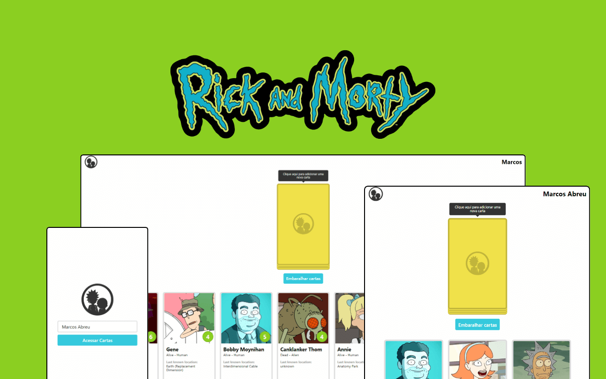

<h1 align="center">
    
</h1>

<h4 align="center"> 
	Rick and Morty Random Cards Generator
</h4>

<p align="center">
    
</p>

## Sobre o Projeto

Um sistema simples que gera personagens aleatórios da animação Rick and Morty em formato de cartas, utilizando a [The Rick and Morty API](https://rickandmortyapi.com/). O desenvolvimento do projeto foi baseado nas metologias de boas práticas de programação como DDD e Arquitetura Limpa, visando a reutilização e o isolamento de código.

## Tecnologias

Esse projeto foi desenvolvido com as seguintes tecnologias:

- ViteJs
- ReactJS
- Typescript
- SASS
- Axios
- Lodash

## Como Executar

Para executar esse layout, você vai precisar do Git e do NodeJS (v18.12.0) instalados no seu computador.

```
# Clone esse repositóro
$ git clone https://github.com/marcosolvr/random-rick-and-morty-cards.git

# Instale as dependências
$ npm install             # ou $ yarn

# Execute o comando
$ npm run dev

# Acesse a url gerada pelo Vite
```

# Melhorias futuras

- Utilizar a biblioteca React Beautiful DND para adicionar a funcionalidade de arrastar e soltar nas cartas;

- Melhorar a isolamento das regras de negócio da aplicação;

- Adicionar testes unitários na camada de domínio da aplicação;

- Adicionar testes de integração na camada de infraestrutura da aplicação;

- Adicionar testes de UI na camada de interface da aplicação;

- Alterar as requisições de REST para GraphQL.

## Autor


